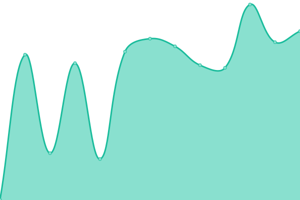
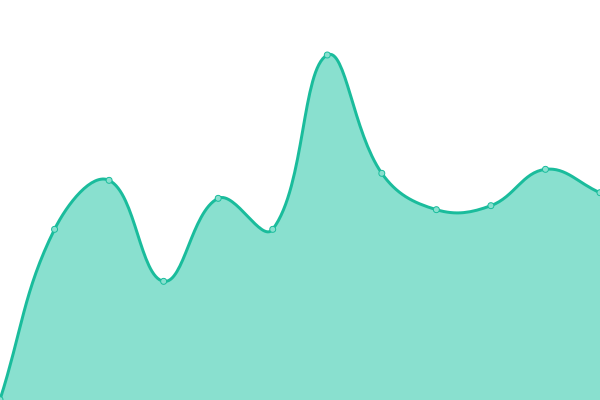

# [📈 Live Status](https://status.limes.pink): <!--live status--> **🟩 All systems operational**

This repository contains the open-source uptime monitor and status page for [ash](limes.pink), powered by [Upptime](https://github.com/upptime/upptime).

With [Upptime](https://upptime.js.org), you can get your own unlimited and free uptime monitor and status page, powered entirely by a GitHub repository. We use [Issues](https://github.com/gitlimes/status/issues) as incident reports, [Actions](https://github.com/gitlimes/status/actions) as uptime monitors, and [Pages](https://status.limes.pink) for the status page.

<!--start: status pages-->
<!-- This summary is generated by Upptime (https://github.com/upptime/upptime) -->
<!-- Do not edit this manually, your changes will be overwritten -->
<!-- prettier-ignore -->
| URL | Status | History | Response Time | Uptime |
| --- | ------ | ------- | ------------- | ------ |
|  [limes.pink](https://limes.pink) | 🟩 Up | [limes-pink.yml](https://github.com/gitlimes/status/commits/HEAD/history/limes-pink.yml) | 

 2125ms
     
 | 

<a href="https://status.limes.pink/history/limes-pink">100.00%</a>
    

|  [microsoftgithub.com](https://microsoftgithub.com/usage) | 🟩 Up | [microsoftgithub-com.yml](https://github.com/gitlimes/status/commits/HEAD/history/microsoftgithub-com.yml) | 

 432ms
     
 | 

<a href="https://status.limes.pink/history/microsoftgithub-com">100.00%</a>
    

|  [Discord Markdown Badge (user endpoint)](https://dcbadge.limes.pink/api/shield/406125028065804289) | 🟩 Up | [discord-markdown-badge-user-endpoint.yml](https://github.com/gitlimes/status/commits/HEAD/history/discord-markdown-badge-user-endpoint.yml) | 

 784ms
     
 | 

<a href="https://status.limes.pink/history/discord-markdown-badge-user-endpoint">100.00%</a>
    

|  [Discord Markdown Badge (server endpoint)](https://dcbadge.limes.pink/api/server/zkspfFwqDg) | 🟩 Up | [discord-markdown-badge-server-endpoint.yml](https://github.com/gitlimes/status/commits/HEAD/history/discord-markdown-badge-server-endpoint.yml) | 

 116ms
     
 | 

<a href="https://status.limes.pink/history/discord-markdown-badge-server-endpoint">90.73%</a>
    

|  [fedi.limes.pink (fedi instance)](https://fedi.limes.pink/@limes) | 🟩 Up | [fedi-limes-pink-fedi-instance.yml](https://github.com/gitlimes/status/commits/HEAD/history/fedi-limes-pink-fedi-instance.yml) | 

 646ms
     
 | 

<a href="https://status.limes.pink/history/fedi-limes-pink-fedi-instance">100.00%</a>
    

|  [cors.limes.pink (personal cors-proxy)](https://cors.limes.pink) | 🟩 Up | [cors-limes-pink-personal-cors-proxy.yml](https://github.com/gitlimes/status/commits/HEAD/history/cors-limes-pink-personal-cors-proxy.yml) | 

 488ms
     
 | 

<a href="https://status.limes.pink/history/cors-limes-pink-personal-cors-proxy">100.00%</a>
    

<!--end: status pages-->

[**Visit our status website →**](https://status.limes.pink)

## 📄 License

- Powered by: [Upptime](https://github.com/upptime/upptime)
- Code: [MIT](./LICENSE) © [ash](limes.pink)
- Data in the `./history` directory: [Open Database License](https://opendatacommons.org/licenses/odbl/1-0/)
